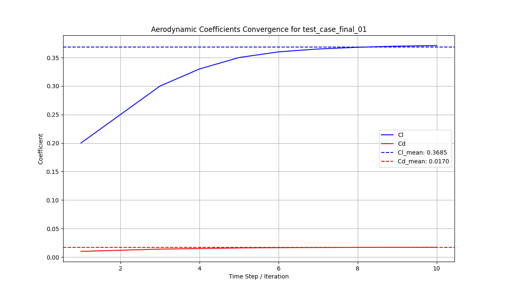

# AICFD Calculation Report

**Case Name**: test_case_final_01

---

## 1. Input Parameters

```json
{
    "case_name": "test_case_final_01",
    "geometry": {
        "type": "file",
        "path": "assets/simple_cube.obj"
    },
    "solver_settings": {
        "solver": "\"C:/Users/bst13/miniforge3/python.exe\" \"D:/code/aircraft-design-skill/aircraft_design/aicfd_agent_py/mock_solver.py\"",
        "endTime": 500,
        "deltaT": 0.5,
        "timeout": 30
    }
}
```

---

## 2. Key Results (Converged)

| Coefficient | Value |
|-------------|:-----:|
| Cl (mean)   | 0.36850 |
| Cd (mean)   | 0.01702 |
| Cm (mean)   | 0.13000 |

---

## 3. Convergence History



