# Aircraft Design Skill Landscape Analysis

## 1. Skill Summary

| Skill Name | Description |
| :--- | :--- |
| `fixed_wing_advanced_overall_runbook` | 执行包含高级分析与机身几何的固定翼总体设计流程。用户要求首次方案就含高级分析、几何约束与机身外形时调用。 |
| `fixed_wing_aero_runbook` | 执行固定翼气动一级模型计算（极曲线参数、巡航 L/D）。当需要把气动假设接入性能/重量闭环时调用。 |
| `fixed_wing_aero_spec` | 固定翼气动方案设计：阻力分解、极曲线、升阻比与高升力装置取值范围。当需要建立可用于性能/重量闭合的气动模型时调用。 |
| `fixed_wing_constraints_runbook` | 执行固定翼约束校核并输出设计点余度。当需要快速判断给定 W/S、T/W 是否满足巡航/爬升/失速/起降距离约束时调用。 |
| `fixed_wing_constraints_spec` | 固定翼约束分析方案：失速/巡航/爬升/起降距离等约束线与设计点选择。当需要用约束分析确定 W/S 与 T/W 设计点时调用。 |
| `fixed_wing_design_loop_runbook` | 驱动固定翼总体设计迭代收敛（设计点/重量/气动/性能/尾翼）。当需要进行参数迭代与敏感性检查时调用。 |
| `fixed_wing_overall_sizing_runbook` | 执行固定翼总体设计闭环计算并输出 results.json/report.md 以及交互式图表。当需要从输入需求一键得到可计算方案、详细报告与可视化结果时调用。 |
| `fixed_wing_overall_sizing_spec` | 生成固定翼总体设计方案（需求→约束→设计点→初步尺寸→重量/性能闭合）。当需要给出固定翼总体方案、关键参数范围与决策依据时调用。 |
| `fixed_wing_performance_runbook` | 执行固定翼一级性能快算（巡航所需推力、爬升率）并输出性能余度。当需要快速校核方案可行性时调用。 |
| `fixed_wing_performance_spec` | 固定翼性能快算方案：巡航配平、所需推力、爬升率等一级性能校核。当需要对总体方案做快速性能余度检查时调用。 |
| `fixed_wing_propulsion_runbook` | 执行固定翼推进一级假设检查并输出燃油估算所需参数。当需要把推进参数接入航程与重量闭合时调用。 |
| `fixed_wing_propulsion_spec` | 固定翼推进/能量系统方案：推力/功率等级、耗油/效率模型与可用推力随高度速度变化。当需要把推进假设接入总体性能闭环时调用。 |
| `fixed_wing_shape_detail_runbook` | 执行固定翼外形详细设计的产物生成（翼型/机身剖面/三视图HTML/创成式搜索/OpenVSP脚本）。用户要一键产出外形资产并验证时调用。 |
| `fixed_wing_shape_detail_spec` | 定义固定翼外形详细设计（翼型/机身剖面/三视图预览）接口与验收标准。用户需要把外形细化并与总体输入对齐时调用。 |
| `fixed_wing_shape_parametric_runbook` | 执行固定翼全外形参数化的落地流程（参数→派生→网格→四视图/轴测→回归测试）。用户要逐步细化外形并可视化时调用。 |
| `fixed_wing_shape_parametric_spec` | 定义固定翼全外形参数化（翼/尾/机身/翼型/布局/控制点）输入与派生规则。用户要把外形完全参数化并逐步细化时调用。 |
| `fixed_wing_stability_control_runbook` | 执行固定翼尾翼初算（尾容积系数法）并输出 Sh/Sv。当需要快速得到尾翼面积初值用于总体迭代时调用。 |
| `fixed_wing_stability_control_spec` | 固定翼稳定与操纵方案：尾容积系数定尺寸、静稳定裕度与配平接口。当需要从总体几何推导尾翼与稳定性初算时调用。 |
| `fixed_wing_stage2_7_plan` | 规划固定翼阶段2-7功能分解、接口字段与验收标准。当需要扩展阻力分解/推进模型/任务剖面/稳定结构/迭代优化时调用。 |
| `fixed_wing_structures_loads_runbook` | 执行固定翼结构/载荷一级估算与重量回馈的步骤说明。当需要把结构可行性纳入总体迭代时调用。 |
| `fixed_wing_structures_loads_spec` | 固定翼结构与载荷方案：载荷因子/突风、弯矩剪力量级、一级定尺寸与结构重量回馈。当需要将结构可行性纳入总体迭代时调用。 |
| `fixed_wing_weights_runbook` | 执行固定翼 Class I 重量闭合并输出重量分解。当需要在总体迭代中快速收敛 MTOW/燃油重量时调用。 |
| `fixed_wing_weights_spec` | 固定翼重量方案（Class I）：空重统计模型 + 航程燃油估算 + MTOW 迭代闭合。当需要建立重量闭合与敏感性分析时调用。 |

## 2. Functional Map (Mermaid)

```mermaid
graph TD
    subgraph Overall
        fixed_wing_advanced_overall_runbook["advanced_overall_runbook"]
        fixed_wing_design_loop_runbook["design_loop_runbook"]
        fixed_wing_overall_sizing_runbook["overall_sizing_runbook"]
        fixed_wing_overall_sizing_spec["overall_sizing_spec"]
        fixed_wing_stage2_7_plan["stage2_7_plan"]
    end
    subgraph Aerodynamics
        fixed_wing_aero_runbook["aero_runbook"]
        fixed_wing_aero_spec["aero_spec"]
    end
    subgraph Performance
        fixed_wing_constraints_runbook["constraints_runbook"]
        fixed_wing_constraints_spec["constraints_spec"]
        fixed_wing_performance_runbook["performance_runbook"]
        fixed_wing_performance_spec["performance_spec"]
    end
    subgraph Propulsion
        fixed_wing_propulsion_runbook["propulsion_runbook"]
        fixed_wing_propulsion_spec["propulsion_spec"]
    end
    subgraph Geometry
        fixed_wing_shape_detail_runbook["shape_detail_runbook"]
        fixed_wing_shape_detail_spec["shape_detail_spec"]
        fixed_wing_shape_parametric_runbook["shape_parametric_runbook"]
        fixed_wing_shape_parametric_spec["shape_parametric_spec"]
    end
    subgraph Stability
        fixed_wing_stability_control_runbook["stability_control_runbook"]
        fixed_wing_stability_control_spec["stability_control_spec"]
    end
    subgraph Structures
        fixed_wing_structures_loads_runbook["structures_loads_runbook"]
        fixed_wing_structures_loads_spec["structures_loads_spec"]
    end
    subgraph Weights
        fixed_wing_weights_runbook["weights_runbook"]
        fixed_wing_weights_spec["weights_spec"]
    end
    fixed_wing_overall_sizing_runbook --> fixed_wing_design_loop_runbook
    fixed_wing_overall_sizing_spec -.-> fixed_wing_overall_sizing_runbook
    fixed_wing_design_loop_runbook --> fixed_wing_weights_runbook
    fixed_wing_design_loop_runbook --> fixed_wing_aero_runbook
    fixed_wing_design_loop_runbook --> fixed_wing_propulsion_runbook
    fixed_wing_design_loop_runbook --> fixed_wing_performance_runbook
    fixed_wing_aero_spec -.-> fixed_wing_aero_runbook
    fixed_wing_constraints_spec -.-> fixed_wing_constraints_runbook
    fixed_wing_overall_sizing_spec -.-> fixed_wing_overall_sizing_runbook
    fixed_wing_performance_spec -.-> fixed_wing_performance_runbook
    fixed_wing_propulsion_spec -.-> fixed_wing_propulsion_runbook
    fixed_wing_shape_detail_spec -.-> fixed_wing_shape_detail_runbook
    fixed_wing_shape_parametric_spec -.-> fixed_wing_shape_parametric_runbook
    fixed_wing_stability_control_spec -.-> fixed_wing_stability_control_runbook
    fixed_wing_structures_loads_spec -.-> fixed_wing_structures_loads_runbook
    fixed_wing_weights_spec -.-> fixed_wing_weights_runbook
    fixed_wing_constraints_runbook --> fixed_wing_overall_sizing_runbook
```



## 3. Detailed Skill Contents

### fixed_wing_advanced_overall_runbook

> **Path**: `.trae/skills/fixed_wing_advanced_overall_runbook/SKILL.md`

# 固定翼高级总体设计执行步骤（Runbook）

## 目标

首次设计即包含：
- 机身外形/翼身布局参与
- 几何高级分析（几何一致性校核、面积分布等）
- 约束/重量/气动/性能/稳定/结构/推进的一体化输出

## 入口

- 输入文件：JSON
- 执行脚本：`scripts/run_fixed_wing_design.py`

## 必要输入补强（在首次方案中加入）

1. `geometry` 与 `geometry_shape`
   - `geometry.fuselage_length_m`、`geometry.fuselage_diameter_m`
   - `geometry_shape.fuselage.axis.length_m`
   - `geometry_shape.fuselage.profile`（控制点或半径）
2. `geometry_parametric` 或 `geometry_shape.wing.planform`
   - 确保翼展弦比/翼面积可由 `sizing` 或 `geometry_shape` 推导
3. `geometry_constraints`（可选但推荐）
   - 用于几何一致性/约束校核输出到 `advanced_shape_results.json`
4. `openvsp`
   - `enabled: true` 以生成 OpenVSP 脚本
5. `uncertainty`
   - `enabled: true` 以输出不确定性敏感性结果

## 快速步骤

1. 基于示例输入复制并修改：

```powershell
copy .\examples\fixed_wing_ga_single.json .\examples\fixed_wing_advanced_first.json
```

2. 在新文件中补齐首次高级设计字段：
   - `geometry` + `geometry_shape`（含机身与机翼/尾翼）
   - `geometry_constraints`（如允许的最小翼身间距、翼梁厚度等）
   - `openvsp.enabled=true`
   - `uncertainty.enabled=true`

3. 运行：

```powershell
python .\scripts\run_fixed_wing_design.py .\examples\fixed_wing_advanced_first.json
```

## 输出检查

- `out/results/results.json`：总体设计结果
- `out/report/report.md`：报告
- `out/geometry/advanced_shape_results.json`：高级几何分析结果
- `out/report/area_rule_report.md`：面积分布报告
- `out/openvsp/openvsp_advanced.py`：OpenVSP 脚本
- `out/mesh/geometry_mesh.json`：三维网格

## 迭代建议

- 机身外形不合理：调整 `geometry_shape.fuselage.profile` 控制点与长度/半径
- 约束不过：先改 `sizing`（W/S、AR、T/W），再优化 `aero` 与 `propulsion`
- 高级几何警告：补齐或修正 `geometry_constraints`


---

### fixed_wing_aero_runbook

> **Path**: `.trae/skills/fixed_wing_aero_runbook/SKILL.md`

# 固定翼气动执行（Runbook）

## 当前实现范围

- 使用 `CD = CD0 + k * CL^2` 极曲线
- `k` 由 `AR` 与 `e` 计算
- 巡航点 `L/D` 由巡航工况与重量/翼面积计算

## 推荐入口

- 一键总体脚本：`scripts/run_fixed_wing_design.py`

## 迭代建议

- `cd0` 过大通常直接损害航程与爬升：优先检查外形阻力与构型增量假设
- `e` 偏低会显著增大诱导阻力：优先检查 AR、翼尖与布局干扰
- `cl_max` 决定失速约束上界：与高升力装置策略联动调整


---

### fixed_wing_aero_spec

> **Path**: `.trae/skills/fixed_wing_aero_spec/SKILL.md`

# 固定翼气动方案（Spec）

## 目标

- 输出可用于总体闭环的气动极曲线模型：`CD = CD0 + k * CL^2`
- 定义起飞/着陆构型下的 `CLmax` 与阻力增量策略（后续细化）

## 输入

- 几何初值：`S`, `AR`, `b`, `cbar`
- 任务工况：巡航高度/速度
- 初始气动假设：`cd0`, `e`, `cl_max`

## 输出

- `cd0`：零升阻系数
- `k`：诱导阻力系数（由 `AR` 与 `e` 给出）
- `L/D`：巡航点升阻比估算
- 高升力建议：`cl_max` 与起降构型策略（需要满足失速/起降约束）


---

### fixed_wing_constraints_runbook

> **Path**: `.trae/skills/fixed_wing_constraints_runbook/SKILL.md`

# 固定翼约束分析执行（Runbook）

## 推荐入口

- 一键总体脚本：`aircraft_design/run_sizing.py`

## 输出位置

- `out/results.json` 的 `constraints` 字段
- `out/report.md` 的“约束校核”章节

## 迭代建议

- `stall_ws` 裕度不足：降低 `wing_loading_pa` 或提高 `cl_max`
- `cruise` 余度不足：降低 `cd0`、提高 `e/AR` 或提高推重比
- `climb_gradient` 余度不足：提高推重比或降低重量/阻力
- `takeoff_distance` 裕度不足：提高推重比或提高起飞构型 `CLmax`
- `landing_distance` 裕度不足：提高着陆构型 `CLmax` 或放宽着陆距离
## 几何约束校核

除了性能约束外，还应校核几何约束。调用 `aircraft_design/geometry_constraints.py` 进行检查：

1.  **燃油容积**：机翼内部可用体积 >= 任务所需燃油体积。
2.  **展弦比**：AR <= 结构或停机位限制。

```python
from aircraft_design.geometry_constraints import GeometryConstraintChecker
# ... 实例化 checker ...
results = checker.check_all()
```


---

### fixed_wing_constraints_spec

> **Path**: `.trae/skills/fixed_wing_constraints_spec/SKILL.md`

# 固定翼约束分析（Spec）

## 目标

- 形成可扩展的约束分析框架，用于选择总体设计点
- 输出设计点处每条约束的需求与余度

## 输入

- 任务：巡航高度/速度、失速速度、爬升梯度与爬升速度
- 任务（可选）：起飞/着陆距离限制与地面参数
- 气动：`cd0`, `e`, `AR`, `cl_max`
- 设计变量：候选 `wing_loading_pa`、可用 `thrust_to_weight`

## 输出

- 设计点：`wing_loading_pa` 与 `thrust_to_weight_available`
- 约束校核清单：
  - `cruise`：巡航所需 `T/W`
  - `climb_gradient`：爬升梯度所需 `T/W`
  - `stall_ws`：失速约束 `W/S` 上界与裕度
  - `takeoff_distance`：起飞距离约束（由 `T/W` 与高升力 `CLmax` 联合决定）
  - `landing_distance`：着陆距离约束（由高升力 `CLmax` 与制动减速度决定）
  - `takeoff_climb_gradient`：起飞构型爬升梯度（引入高升力构型的 `ΔCD0`）
- 约束线数据结构（后续扩展）：用于绘制 `W/S`–`T/W` 可行域


---

### fixed_wing_design_loop_runbook

> **Path**: `.trae/skills/fixed_wing_design_loop_runbook/SKILL.md`

# 固定翼迭代收敛（Runbook）

## 目标

- 将总体设计闭环固化为可重复执行的迭代步骤

## 当前版本范围

- 已实现：总体设计点约束（失速上界）、Class I 重量闭合、巡航推力需求、爬升率快算、尾翼体积系数定尺寸
- 待扩展：起降距离模型、可用推力随高度速度变化、结构重量回馈、静稳定/配平细化

## 建议迭代顺序

1. 固定构型与推进类型，给出初猜：`wing_loading_pa`, `aspect_ratio`, `thrust_to_weight`, `cd0`, `e`, `cl_max`
2. 跑一次闭环计算，记录不满足项：
   - 失速约束是否满足
   - 航程燃油分数是否合理
   - 巡航所需推力与爬升率是否满足
3. 只调整一个变量做敏感性：
   - 航程不足：优先提高 `L/D`（降低 `cd0`、提高 `e`、提高 `AR`）或改善推进耗油模型
   - 爬升不足：提高 `thrust_to_weight` 或降低重量/阻力
   - 失速不足：降低 `wing_loading_pa` 或提高 `cl_max`
4. 收敛判据（建议）：
   - `w0_kg` 相对变化 < 1e-3
   - 关键性能余度均为正且留有裕度（按项目要求设阈值）


---

### fixed_wing_overall_sizing_runbook

> **Path**: `.trae/skills/fixed_wing_overall_sizing_runbook/SKILL.md`

# Fixed Wing Overall Sizing Runbook

此技能用于执行固定翼飞机 Class I 总体设计闭环流程。它将调用 `aircraft_design/run_sizing.py` 脚本，基于输入需求进行迭代计算，直到 MTOW 收敛，并生成符合标准模板的报告及交互式图表。

## 适用场景
*   用户提供了一组设计需求（如航程、载荷、速度），希望快速得到飞机总体参数。
*   用户希望验证当前设计代码是否能针对特定需求收敛。
*   需要生成总体设计报告 (`report.md`) 和可视化分析 (`interactive_charts.html`)。

## 执行步骤

### 1. 准备输入文件 (`sizing_input.json`)

首先，根据用户提供的信息构建 JSON 输入文件。如果用户未提供某些字段，使用以下**轻型战斗机默认值**：

```json
{
  "requirements": {
    "range_m": 2000000.0,
    "payload_kg": 1000.0,
    "cruise_mach": 0.8,
    "cruise_altitude_m": 11000.0,
    "takeoff_distance_m": 1000.0,
    "landing_distance_m": 1000.0,
    "max_load_factor": 7.33,
    "sustained_turn_g": 2.0,
    "service_ceiling_m": 15000.0
  },
  "initial_guess": {
    "thrust_to_weight": 0.6,
    "wing_loading_pa": 3000.0,
    "aspect_ratio": 3.5,
    "sweep_deg": 45.0,
    "taper_ratio": 0.3,
    "thickness_ratio": 0.08,
    "sfc_cruise_1_s": 0.000222, 
    "cd0": 0.02,
    "oswald_e": 0.8
  }
}
```

*注意：`sfc_cruise_1_s` = 0.8 / 3600 ≈ 0.000222*

使用 `Write` 工具创建 `sizing_input.json` 文件。

### 2. 执行 Sizing Loop（带可视化）

Sizing Loop 内置了自动可视化功能。默认情况下，它会自动检测并启动可视化服务器，在独立窗口中显示收敛曲线、约束图和飞机几何预览。

**基本用法**：
使用 `RunCommand` 工具执行以下命令：

```bash
export PYTHONPATH=$PYTHONPATH:$(pwd)
python3 -m aircraft_design.run_sizing sizing_input.json --project-name MyDesign
```

**可选参数**：
*   `--no-viz`: 如果不需要实时可视化（例如在纯后台模式运行），可添加此参数关闭图形界面。

**可视化交互说明**：
*   **自动启动**：脚本运行时会自动弹出一个 3D 可视化窗口（无需手动开启服务器）。
*   **监控**：用户可以实时观察 MTOW 收敛情况、约束分析图以及飞机的 3D 几何变化。
*   **结束**：脚本执行完成后会自动退出，但可视化窗口会**保持打开**状态，以便用户继续查看结果。用户可随时手动关闭窗口。

### 3. 检查结果


1.  **检查退出码**：
    *   `0`: 成功且收敛。
    *   `2`: 运行完成但**未收敛**（需警告用户）。
    *   `1`: 发生错误（需调试）。

2.  **定位输出目录**：
    输出位于 `output/` 目录下以 `MyDesign_` 开头的时间戳文件夹中。使用 `LS` 工具找到最新的文件夹。

3.  **读取报告**：
    使用 `Read` 工具读取生成的 `design_report.md` 文件内容。

4.  **反馈用户**：
    将 `design_report.md` 的核心内容（MTOW、T/W、W/S、关键重量分解、操稳特性摘要）总结给用户，并提示用户可以在输出目录查看交互式图表 `interactive_charts.html`。


---

### fixed_wing_overall_sizing_spec

> **Path**: `.trae/skills/fixed_wing_overall_sizing_spec/SKILL.md`

# 固定翼总体设计方案（Spec）

## 目的

- 将固定翼总体设计流程标准化输出为可迭代方案
- 给出关键设计变量的推荐取值、约束关系与余度检查

## 输入

使用统一 JSON 输入，建议字段：

- `mission`: 航程、巡航高度/速度、失速速度等
- `payload`, `crew`: 载荷与机组重量
- `aero`: 初猜气动（`cd0`, `e`, `cl_max`）
- `sizing`: 初猜设计变量（`wing_loading_pa`, `aspect_ratio`, `thrust_to_weight`）
- `weights`: 空重统计模型参数与燃油储备
- `propulsion`: 推进类型与耗油/效率模型

## 输出

方案输出建议包含：

- 设计点：`wing_loading_pa`、`thrust_to_weight`
- 主尺度：`S`、`b`、`\bar{c}`
- 气动模型：`cd0`、`k`、巡航 `L/D`
- 重量闭合：`W0`、`We`、`Wf`
- 关键性能余度：巡航所需推力、爬升率

## 关键规则

- 设计点必须满足失速约束上界：`(W/S) <= q * CLmax`
- 重量、气动、性能必须在同一组几何与工况假设下闭合


---

### fixed_wing_performance_runbook

> **Path**: `.trae/skills/fixed_wing_performance_runbook/SKILL.md`

# 固定翼性能快算执行（Runbook）

## 推荐入口

- 一键总体脚本：`scripts/run_fixed_wing_design.py`

## 单独性能校核时的必需输入

- `sizing.s_m2`（或由 `w0_kg` 与 `wing_loading_pa` 推得）
- `aero.cd0`, `aero.e`, `sizing.aspect_ratio`
- `mission.cruise_altitude_m`, `mission.cruise_speed_m_s`
- `sizing.thrust_to_weight`（用于爬升快算的推力等级）

## 输出解读

- `cruise_required_thrust_n`：巡航点阻力对应的所需推力
- `climb_rate_m_s`：基于推力等级与阻力模型的一级爬升率估算


---

### fixed_wing_performance_spec

> **Path**: `.trae/skills/fixed_wing_performance_spec/SKILL.md`

# 固定翼性能快算方案（Spec）

## 目标

- 对总体方案做一级性能校核（巡航与爬升为第一优先）
- 将性能约束与总体设计点、气动模型保持一致

## 输入

- 重量：`w0_kg`（或任务工况重量）
- 几何：`S`, `AR`
- 气动：`cd0`, `e`
- 推进：`T/W`（或 `T_avail(h,V)` 模型，后续扩展）
- 任务工况：巡航高度/速度、爬升速度（可选）

## 输出

- `cruise_required_thrust_n`
- `climb_rate_m_s`
- 性能余度与不满足项列表（后续扩展）


---

### fixed_wing_propulsion_runbook

> **Path**: `.trae/skills/fixed_wing_propulsion_runbook/SKILL.md`

# 固定翼推进执行（Runbook）

## 目标

- 确保推进输入可用于 Breguet 航程与重量闭合

## 输入检查

- `propulsion.type == prop`：
  - 必需：`sfc_1_s`, `prop_efficiency`
- `propulsion.type == jet`：
  - 必需：`tsfc_1_s`

## 推荐入口

- 一键总体脚本：`scripts/run_fixed_wing_design.py`


---

### fixed_wing_propulsion_spec

> **Path**: `.trae/skills/fixed_wing_propulsion_spec/SKILL.md`

# 固定翼推进方案（Spec）

## 目标

- 给出推进类型（螺桨/喷气）下的一级模型，支撑航程燃油估算与性能校核

## 输入

- `propulsion.type`: `prop` 或 `jet`
- 螺桨：`sfc_1_s`, `prop_efficiency`
- 喷气：`tsfc_1_s`
- 额定推力/功率等级（由总体设计点给出，后续可扩展为发动机地图）

## 输出

- 航程燃油估算可用的 `SFC/TSFC/η` 模型参数
- 推力/功率等级建议与使用边界（后续扩展为 `T_avail(h,V)`）


---

### fixed_wing_shape_detail_runbook

> **Path**: `.trae/skills/fixed_wing_shape_detail_runbook/SKILL.md`

# 固定翼外形详细设计（Runbook）

## 目标

- 从单一输入 JSON 出发，生成可复用外形资产与可视化
- 支持创成式外形搜索（候选集 + 每个候选的三视图预览）
- 支持 OpenVSP 脚本导出（可选在 OpenVSP Python 环境执行）

## 一键运行

### 1) 生成总体结果 + 三视图预览

```powershell
python .\scripts\run_fixed_wing_design.py .\examples\fixed_wing_ga_single.json
```

产物（`out/`）：

- `geometry_3d.html`：三视图预览
- `geometry.obj`：OBJ 资产
- `geometry_mesh.json`：网格 JSON

### 2) 生成 OpenVSP 脚本

```powershell
python .\scripts\generate_openvsp_script.py .\examples\fixed_wing_ga_single.json --out .\out\openvsp_generate.py
```

如在 OpenVSP 的 Python 环境中，可加 `--run` 直接生成 `generated.vsp3`。

### 3) 创成式外形搜索（候选集）

```powershell
python .\scripts\shape_search.py .\examples\fixed_wing_ga_single.json --n 32 --seed 1
```

产物（`out/`）：

- `shape_search_report.md`：Top 候选表格（含 3D 链接）
- `shape_search_results.json`：全部候选与可行集
- `shapes/shape_*.html`：每个候选的三视图预览

## 验证

```powershell
python -m unittest discover -s tests
```


---

### fixed_wing_shape_detail_spec

> **Path**: `.trae/skills/fixed_wing_shape_detail_spec/SKILL.md`

# 固定翼外形详细设计（Spec）

本阶段目标：在总体设计闭环已经可跑的前提下，把外形从“参数化占位”推进到“可追溯的详细几何输入”，并且提供可视化（优先三视图），为后续 OpenVSP/VSPAero/更高保真分析做接口准备。

## 1. 输入接口（建议字段）

### 1.1 `geometry_parametric`（已有）

- `wing.aspect_ratio`
- `wing.taper_ratio`
- `wing.sweep_quarter_chord_deg`
- `wing.t_c`
- `fuselage.length_m`
- `fuselage.diameter_m`
- `tail.area_ratio_to_wing`

### 1.2 `geometry_detailed`（新增）

#### 机翼翼型

- `geometry_detailed.wing.airfoil`
  - `type`: `"naca4"`（当前支持）
  - `code`: 例如 `"2412"`
  - `n`: 采样点数（默认 161）

#### 机身剖面（轴对称站位序列）

- `geometry_detailed.fuselage.stations`: list
  - 每项：`{ "x_m": number, "radius_m": number }`
  - 要求：`x_m` 单调递增（系统会排序），`radius_m >= 0`

### 1.3 `geometry_search`（创成式搜索）

- 允许设置范围：`aspect_ratio/taper_ratio/sweep_quarter_chord_deg/t_c/fuselage_length_m/fuselage_diameter_m/tail_area_ratio_to_wing`
- 每项格式：`{ "min": number, "max": number }`

## 2. 输出接口（建议字段）

- `results.geometry_detailed`
  - `wing.airfoil.coords`：翼型坐标（归一化 chord）
  - `fuselage.stations`：站位剖面输入快照（排序后）
- `results.artifacts`
  - `geometry_3d_html`: 三视图 HTML 文件名
  - `geometry_obj`: OBJ 文件名
  - `geometry_mesh_json`: 网格 JSON 文件名

## 3. 可视化验收（必须）

- 默认输出为三视图：Top (X-Y)、Side (X-Z)、Front (Y-Z)
- 若 Three.js 加载失败（CDN/离线/受限环境），必须自动降级显示线框投影，保证不“空白”

## 4. 验收标准（可执行）

- 输入仅提供 `geometry_parametric` 时：可生成三视图预览与 OBJ/JSON 资产
- 输入提供 `geometry_detailed.wing.airfoil` 时：`results.geometry_detailed.wing.airfoil.coords` 可用且点数正确
- 输入提供 `geometry_detailed.fuselage.stations` 时：结果中包含排序后的 stations
- 所有测试可通过：`python -m unittest discover -s tests`


---

### fixed_wing_shape_parametric_runbook

> **Path**: `.trae/skills/fixed_wing_shape_parametric_runbook/SKILL.md`

# 固定翼全外形参数化（Runbook）

## 0) 目标

- 先统一“外形可重建的参数字典”（geometry_shape / geometry_detailed）
- 再逐步增加自由度（控制点），并在每步都能输出可视化资产

## 1) 起步：只用 `geometry_detailed`

输入：

- `geometry_detailed.wing.airfoil`（NACA4）
- `geometry_detailed.fuselage.stations`（站位）

运行：

```powershell
python .\scripts\run_fixed_wing_design.py .\examples\fixed_wing_ga_single.json
```

查看：

- `out/geometry_3d.html`（四视图：Top/Side/Front + Iso 可旋转）

## 2) 升级：把站位改为控制点（建议）

将机身 profile 改为控制点模式（`x_rel/radius_rel`），派生为 `stations` 后再网格化。

## 3) 翼型升级

- 根/梢不同翼型：`root_airfoil` 与 `tip_airfoil`
- 增加 spanwise 控制点：扭转/弦长/厚度比沿展向变化

## 4) 可视化布局参数化

按需选择视图集合与网格：

- `views`: `['top','side','front','iso']`
- `grid`: `{rows:2, cols:2}`

## 5) 验证

```powershell
python -m unittest discover -s tests
```

## 6) 细化清单（建议推进顺序）

- 布局/坐标系：机翼安装角、上反角、机翼位置（x/z）、尾翼类型与位置
- 机翼：根/梢不同翼型、展向扭转与弦长控制点、襟副翼段落与铰线
- 机身：轴对称站位→控制点→（可选）非轴对称截面、座舱罩/整流罩
- 尾翼：平尾/垂尾分别的剖面与控制点、V 尾/双垂尾布局
- 外形一致性：翼身干扰、尾翼与机身过渡（简化 fillet）
- 资产输出：OBJ/JSON/OpenVSP 脚本、四视图/多视图布局、候选集对比页


---

### fixed_wing_shape_parametric_spec

> **Path**: `.trae/skills/fixed_wing_shape_parametric_spec/SKILL.md`

# 固定翼全外形参数化（Spec）

目标：把固定翼飞机外形从“少量总体参数”推进为“可完整重建外形的参数集”，并允许局部通过控制点增强自由度，且保持与总体设计闭环输入兼容。

## 1. 总体原则

- **分层**：`geometry_parametric`（总体级）→ `geometry_detailed`（详细级）→ `geometry_shape`（全参数化+控制点+布局）。
- **可选项参数化**：所有“可选细节”（翼型、机身站位、尾翼剖面、整流罩/舱盖等）必须能用参数开关启用/禁用，且提供默认值。
- **派生一致性**：详细外形应能派生出用于性能/重量闭环的关键几何量（Sref、AR、t/c、wet area 估算参数等），并可回写到 `results`。
- **可视化可复现**：同一输入必须得到一致的三维网格与四视图预览。

## 2. 建议输入：`geometry_shape`（新增）

### 2.1 全局

- `geometry_shape.units`: `"m"`（默认）
- `geometry_shape.layout`：预览布局参数化（见 5）
- `geometry_shape.resolution`
  - `fuselage_n_stations`（默认 21）
  - `airfoil_n_points`（默认 161）
  - `mesh_n_circ`（默认 28）

### 2.2 机翼（Wing）

- `geometry_shape.wing.planform`
  - `s_ref_m2`（可选：若不给由总体结果提供）
  - `aspect_ratio`
  - `taper_ratio`
  - `sweep_quarter_chord_deg`
  - `dihedral_deg`（可选）
  - `incidence_deg`（可选）
- `geometry_shape.wing.sections`
  - `root_airfoil`：`{type:'naca4', code:'2412'}`
  - `tip_airfoil`：`{type:'naca4', code:'0012'}`（可选，默认同根）
  - `blend`：`'linear'`（默认）
- `geometry_shape.wing.controls`（可选，增强自由度）
  - `spanwise_control_points`: `[{eta:0.0..1.0, twist_deg, chord_scale, t_c}]`

### 2.3 机身（Fuselage）

- `geometry_shape.fuselage.axis`
  - `x0_m`（默认 -0.15*L）
  - `length_m`
- `geometry_shape.fuselage.profile`
  - `mode`: `'stations' | 'control_points'`
  - `'stations'`：直接给 `stations=[{x_m,radius_m}]`
  - `'control_points'`：给控制点 `[{x_rel:0..1, radius_rel:0..1}]` + `max_radius_m`
  - `closure`: `'open'`（默认，允许首尾半径为 0）

### 2.4 尾翼（Tail）

- `geometry_shape.tail.horizontal` 与 `geometry_shape.tail.vertical`（可选）
  - planform + section（可复用 wing 的结构）
  - 或采用相对翼面积/容积系数派生

## 3. 派生输出（建议）

- `results.geometry_shape_derived`
  - 归一化后的机身 stations、翼型 coords（根/梢）、网格分辨率快照
- `results.artifacts`
  - `geometry_3d_html`、`geometry_obj`、`geometry_mesh_json`（已存在）

## 4. 验收标准

- 仅用 `geometry_shape` 就能生成：四视图预览 + OBJ + 网格 JSON
- 关闭控制点（使用默认）时，结果与现有 `geometry_parametric/geometry_detailed` 保持一致（误差在容许范围内）
- 单测覆盖：机身控制点→stations，根/梢翼型→翼网格生成，布局参数→HTML 包含相应视图

## 5. 可视化布局参数化

建议 `geometry_shape.layout` 字段：

- `views`: `['top','side','front','iso']`（默认四视图）
- `grid`: `{rows:2, cols:2}`（默认）
- `enable_axes`: `true|false`
- `enable_grid`: `true|false`


---

### fixed_wing_stability_control_runbook

> **Path**: `.trae/skills/fixed_wing_stability_control_runbook/SKILL.md`

# 固定翼稳定与操纵初算执行（Runbook）

## 输入

- `tail.vh`, `tail.vv`
- `tail.lh_m`, `tail.lv_m`
- 机翼几何：来自总体计算的 `s_m2`, `b_m`, `cbar_m`

## 输出

- `tail.sh_m2`, `tail.sv_m2`

## 动态稳定性分析 (New)

在获得尾翼尺寸后，调用 `aircraft_design/stability_dynamic.py` 进行模态分析：

1.  计算纵向模态（短周期、长周期）。
2.  计算横航向模态（荷兰滚、滚转、螺旋）。
3.  评定飞行品质等级（Level 1/2/3）。

```python
from aircraft_design.stability_dynamic import DynamicStabilityAnalyzer
# ... 实例化 analyzer ...
results = analyzer.analyze(...)
```

## 推荐入口

- 一键总体脚本：`scripts/run_fixed_wing_design.py`


---

### fixed_wing_stability_control_spec

> **Path**: `.trae/skills/fixed_wing_stability_control_spec/SKILL.md`

# 固定翼稳定与操纵方案（Spec）

## 目标

- 用尾容积系数法给出水平尾翼/垂直尾翼面积初值
- 为配平阻力与 CG 包线分析预留接口（后续扩展）

## 输入

- 机翼几何：`S`, `b`, `cbar`
- 尾臂：`lh_m`, `lv_m`
- 尾容积系数：`vh`, `vv`

## 输出

- `Sh`, `Sv`：水平/垂直尾翼面积初算
- 稳定性检查项清单（占位）：静稳定裕度、操纵面余度、配平阻力


---

### fixed_wing_stage2_7_plan

> **Path**: `.trae/skills/fixed_wing_stage2_7_plan/SKILL.md`

# 固定翼阶段2-7规划（Spec）

## 阶段 2：气动阻力分解与构型增量

- 目标：由几何与构型假设生成 `cd0` 与可追溯分解
- 输出：`aero.cd0_buildup` 与分解表
- 验收：报告可解释 `cd0` 来源，且随几何变化趋势合理

## 阶段 3：推进随工况变化

- 目标：提供 `T_avail(h,V)` 或 `P_avail(h,V)` 的一级模型
- 输出：巡航/爬升工况下 `available_thrust` 与余度
- 验收：高空巡航推力衰减合理，约束校核一致

## 阶段 4：任务剖面耗油

- 目标：将燃油分数拆分为 taxi/climb/cruise/descent/reserve 等
- 输出：`mission_breakdown`
- 验收：分段耗油和总耗油闭合、可追溯

## 阶段 5：稳定与配平

- 目标：输出静稳定裕度与配平量级
- 输出：`stability.static_margin`、`trim_tail_cl`
- 验收：随 CG/尾容积变化趋势正确

## 阶段 6：结构与载荷

- 目标：估算翼根弯矩剪力与结构重量回馈接口
- 输出：`structures.wing_root_moment_n_m`、`structural_weight_kg`
- 验收：随翼展/载荷因子变化趋势正确

## 阶段 7：迭代与敏感性/优化

- 目标：基于约束过滤，搜索可行解并给出推荐设计点
- 输出：`design_loop.best_sizing` 与候选集
- 验收：能在给定网格内找到可行最优解并输出报告摘要


---

### fixed_wing_structures_loads_runbook

> **Path**: `.trae/skills/fixed_wing_structures_loads_runbook/SKILL.md`

# 固定翼结构与载荷执行（Runbook）

## 当前状态

- 本仓库已建立结构板块的 SKILL 入口与接口定义
- 结构/载荷的 Python 可执行模块将在下一轮迭代补齐（含载荷因子/突风、翼根弯矩剪力、一级定尺寸与重量回馈）

## 预期输入

- 几何：`S`, `b`, `cbar`，机翼/机身布置参数
- 重量：`w0_kg` 与重量分布假设
- 载荷：`n_limit`、突风等级与关键工况

## 预期输出

- 翼根弯矩/剪力的量级与关键工况表
- 结构重量修正项（回馈重量闭合）


---

### fixed_wing_structures_loads_spec

> **Path**: `.trae/skills/fixed_wing_structures_loads_spec/SKILL.md`

# 固定翼结构与载荷方案（Spec）

## 目标

- 在总体设计阶段给出结构载荷与结构重量的一致性接口
- 输出一级结构可行性约束（强度/刚度/屈曲的量级校核，后续细化）

## 输入

- 几何：机翼/机身/尾翼尺度与布置
- 重量：MTOW 与重量分布假设
- 载荷：设计载荷因子、突风等级与关键工况
- 材料/结构假设：翼厚比、梁位置、材料等级

## 输出

- 关键载荷量级：翼根弯矩/剪力
- 一级结构尺寸建议（量级）
- 结构重量修正建议（回馈重量闭合）


---

### fixed_wing_weights_runbook

> **Path**: `.trae/skills/fixed_wing_weights_runbook/SKILL.md`

# 固定翼重量闭合执行（Runbook）

## 目标

- 对给定任务与气动/推进假设，完成 MTOW 闭合
- 输出可回馈总体与性能的重量结果

## 入口与数据字段

- 推荐通过总体一键脚本执行：`aircraft_design/run_sizing.py`
- 若单独使用重量模块，核心输入字段：
  - `weights.empty_a`, `weights.empty_b`
  - `weights.reserve_fraction`
  - `propulsion.type` 与对应 `SFC/TSFC/η`
  - `mission.range_m` 与巡航点 `L/D`（由气动模块给出）

## 步骤

1. 给出空重统计模型参数与燃油储备分数
2. 使用 Breguet 得到任务燃油分数
3. 用迭代闭合方程求解 `W0`
4. 输出 `W0/We/Wf` 与迭代收敛信息

## 重心与平衡分析 (New)

完成重量闭合后，调用 `aircraft_design/weight_balance.py` 进行重心包线分析：

1.  定义各部件重量与力臂（Component）。
2.  定义装载方案（LoadingScenario）。
3.  生成重心包线并校核是否在许用范围内。

```python
from aircraft_design.weight_balance import WeightBalanceAnalyzer
# ... 实例化 analyzer ...
envelope = analyzer.analyze()
```


---

### fixed_wing_weights_spec

> **Path**: `.trae/skills/fixed_wing_weights_spec/SKILL.md`

# 固定翼重量方案（Spec）

## 目标

- 在总体设计早期实现 MTOW（W0）快速闭合
- 输出空重、燃油重量与闭合迭代信息，为性能与结构提供一致重量

## 输入

- 载荷/机组重量
- 空重模型参数：`We = a * W0^b`
- 航程燃油估算：Breguet（喷气/螺桨）
- 储备油分数：`reserve_fraction`

## 输出

- `w0_kg`: MTOW
- `we_kg`: 空重
- `wf_kg`: 燃油
- `fuel_fraction_total`: 总燃油分数（含储备）
- `converged`, `iterations`: 闭合信息


---

