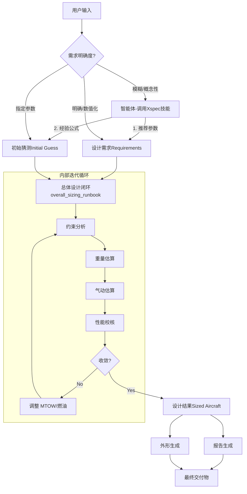

# 固定翼飞行器设计技能体系与执行逻辑指南

本文档旨在梳理固定翼飞行器设计（Fixed Wing Aircraft Design）技能体系的使用逻辑、执行流程及交付物标准。该体系旨在辅助用户从模糊或明确的需求出发，通过一系列标准化的技能（Skills），逐步完成从概念定义到初步方案设计的全过程。

## 1. 技能体系架构 (Skill Architecture)

本设计体系将技能划分为两类：**Spec (规划/定义)** 和 **Runbook (执行/计算)**。

| 技能类型 | 后缀 | 功能描述 | 输入示例 | 输出示例 |
| :--- | :--- | :--- | :--- | :--- |
| **Spec (规划)** | `_spec` | **定义“做什么”**。负责需求分析、参数定义、方案决策、接口规范。弥合用户自然语言与工程参数之间的鸿沟。 | "设计一架长航时无人机" | JSON规范 (DesignRequirements), 约束图定义, 初始猜测值 |
| **Runbook (执行)** | `_runbook` | **执行“怎么做”**。负责数值计算、迭代收敛、数据生成、报告输出。通常封装了底层的 Python 算法模块。 | JSON数据, 配置文件 | `results.json`, `design_report.md`, 几何文件, 性能图表 |

### 核心技能矩阵

| 领域 | Spec 技能 (定义) | Runbook 技能 (执行) |
| :--- | :--- | :--- |
| **总体综合** | `fixed_wing_overall_sizing_spec`<br>总体方案定义（需求->设计点） | `fixed_wing_overall_sizing_runbook`<br>总体设计闭环计算 (Sizing Loop) |
| **约束分析** | `fixed_wing_constraints_spec`<br>约束线定义与设计点选择 | `fixed_wing_constraints_runbook`<br>约束校核与设计点余度分析 |
| **重量工程** | `fixed_wing_weights_spec`<br>重量估算方法选择与系数定义 | `fixed_wing_weights_runbook`<br>Class I/II 重量迭代与清单生成 |
| **气动特性** | `fixed_wing_aero_spec`<br>气动布局与极曲线参数定义 | `fixed_wing_aero_runbook`<br>升阻特性计算与极曲线生成 |
| **推进系统** | `fixed_wing_propulsion_spec`<br>发动机选型与安装损失定义 | `fixed_wing_propulsion_runbook`<br>推力/油耗特性计算 |
| **几何外形** | `fixed_wing_shape_parametric_spec`<br>外形参数化定义 | `fixed_wing_shape_parametric_runbook`<br>三维模型/三视图生成 |

---

## 2. 执行逻辑与工作流 (Workflow Logic)

整个设计流程是一个从**模糊到清晰**、从**定性到定量**的过程。



---

## 3. 用户需求处理逻辑 (User Input Handling)

### 场景 A: 模糊需求 (Ambiguous Requirements)
*   **用户输入**: "我需要设计一款类似于捕食者的长航时察打一体无人机。"
*   **处理逻辑**:
    1.  **意图识别**: 识别关键词 "长航时 (MALE)", "察打一体 (UCAV)", "捕食者 (Predator reference)"。
    2.  **Spec 介入 (`overall_sizing_spec`)**:
        *   调用内部知识库或搜索，获取参考机型（MQ-1/MQ-9）参数。
        *   **生成建议需求**:
            *   Range: 1200 km (Combat Radius) -> Range: 3000 km (Ferry)
            *   Endurance: 24 hr
            *   Payload: 200 kg (Internal) + 50 kg (External)
            *   Altitude: 25,000 ft
            *   Speed: Loiter 70 kts, Cruise 100 kts
    3.  **用户确认**: 智能体展示建议参数，用户确认或微调。
    4.  **执行计算**: 调用 `overall_sizing_runbook`。

### 场景 B: 明确需求 (Definite Requirements)
*   **用户输入**: "设计一架轻型战斗机，航程2000km，载弹1000kg，巡航高度11km，马赫数0.8，起降距离不超过1000m。"
*   **处理逻辑**:
    1.  **参数提取**: 直接解析数值到 `DesignRequirements` 数据结构。
    2.  **缺省值补充 (`overall_sizing_spec`)**: 补充用户未提及但必要的参数（如过载系数 n=7.33, 盘旋过载=5.0g, 升限=15km）。
    3.  **执行计算**: 直接调用 `overall_sizing_runbook`。

### 场景 C: 局部优化/改型 (Optimization/Modification)
*   **用户输入**: "刚才的方案起飞距离太长了，如果把推重比增加到 0.8 会怎么样？"
*   **处理逻辑**:
    1.  **读取上下文**: 加载上一次的 `results.json` 或 `InitialGuess`。
    2.  **参数修改**: 更新 `InitialGuess.thrust_to_weight = 0.8`。
    3.  **重运行**: 调用 `overall_sizing_runbook` 进行 Sensitivity Analysis。
    4.  **对比输出**: 展示新旧方案的 Delta（MTOW 变化、燃油变化）。

---

## 4. 交付物标准 (Deliverables)

每次完整的技能执行（特别是 `overall_sizing_runbook`）应产生以下标准交付物：

| 交付物类型 | 文件名示例 | 内容描述 | 形式 |
| :--- | :--- | :--- | :--- |
| **设计报告** | `report.md` | **Markdown 格式**。包含：<br>1. **摘要**: MTOW, 空重, 燃油, 收敛情况。<br>2. **几何**: 翼展, 机长, 翼面积。<br>3. **重量分解表**: 结构/系统/载荷各分项重量。<br>4. **性能总结**: 满足的约束情况（起降距离、航程等）。 | 文本/表格 |
| **结构化数据** | `results.json` | **JSON 格式**。包含完整的输入（需求、猜测）和输出（收敛解、中间变量），便于后续程序调用或前端展示。 | 代码/数据 |
| **计算日志** | (Console Output) | 迭代过程中的收敛曲线、警告信息（如“起飞推重比约束主导设计”）、错误堆栈。 | 文本流 |
| **几何预览** | (Future) | 三视图 (SVG/PNG)、OpenVSP 脚本 (.vsp3)、CAD 参数文件。 | 图像/文件 |

## 5. 示例：总体设计报告片段

```markdown
# Aircraft Sizing Report

## 1. Summary
- **Converged**: Yes
- **Iterations**: 12
- **MTOW**: 2784.0 kg
- **Empty Weight**: 1250.8 kg

## 2. Performance Compliance
| Constraint | Requirement | Actual | Margin |
| :--- | :--- | :--- | :--- |
| Takeoff Dist | 1000 m | 980 m | +2.0% |
| Landing Dist | 1000 m | 950 m | +5.0% |
| Range | 2000 km | 2000 km | 0.0% |
```
